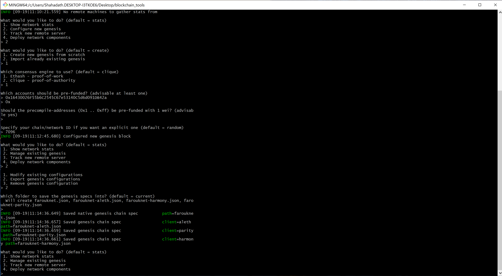

# POA of Authority Development Chain 
---
# **Node creation**
Creation of new nodes 
```
./geth account new --datadir node1
./geth account new --datadir node2
```
----

Generating genesis block by running 
```
*./puppeth
```

## 
```
Network name : farouknet
Blocktime: 15
Network ID:7096
```
Initialize the nodes with genesis json file 
```
* ./geth --datadir node1 init farouknet.json 
* ./geth --datadir node2 init farouknet.json
```

## 

## Begin mining blocks Node 1 

## 
```
./geth --datadir node1 --unlock "d5d48c849EE1B2267306f9e94fFf776921AC7C4F" --mine --rpc --allow-insecure-unlock
 ```

 ## Begin mining blocks Node 2

  ```
./geth --datadir node2 --unlock "309584f8a78e85000366d270723537cf43c9382d" --mine --port 30304 --bootnodes "enode://9b3b4bc71cb48415104365dbf1a3baa7ec5bfd2e@127.0.0.1:30303" --ipcdisable --allow-insecure-unlock
 ```
## 
